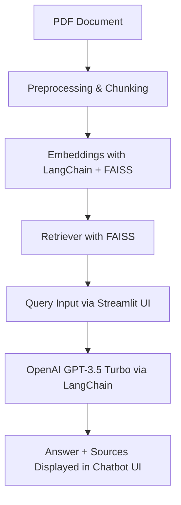

# 🤖 eBay Legal Assistant Chatbot

A RAG (Retrieval-Augmented Generation)-based chatbot built to answer legal and policy-related questions from eBay's documents using OpenAI GPT-3.5 Turbo, FAISS vector store, and Streamlit for UI.

---

## 📌 Project Architecture & Flow



- **PDF Input**: Legal doc is chunked and cleaned.
- **FAISS Vector Store**: Chunks are embedded using `sentence-transformers/all-MiniLM-L6-v2`.
- **Retriever**: Returns relevant chunks.
- **GPT-3.5**: Responds using context + user query.

---

## ⚙️ Setup & Execution Guide

### 🔧 Environment Setup

```bash
# Clone the repo
https://github.com/JalajBaghwala/ebay-legal-chatbot.git
cd ebay-legal-chatbot

# Create virtual env
python -m venv .venv
source .venv/Scripts/activate  # Windows

# Install dependencies
pip install -r requirements.txt

# Create .env file
OPENAI_API_KEY="sk-..."
```

### 🧹 Phase 1: Preprocessing & Chunking

Run the script to split the input document:
```bash
python notebooks/1_preprocess_and_chunk.py
```
This saves cleaned chunks in `chunks/`.

### 📚 Phase 2: Embedding & Vector Store

Generate and store embeddings:
```bash
python notebooks/2_embed_and_store.py
```
This creates the `vectordb/index.faiss` and `index.pkl`.

---

## 🔍 Model & Embedding Choices

| Component            | Model Used                              | Reason                                 |
|---------------------|------------------------------------------|----------------------------------------|
| Embeddings          | `sentence-transformers/all-MiniLM-L6-v2` | Lightweight, fast & effective semantic |
| LLM (Text Gen)      | `gpt-3.5-turbo` via `langchain-openai`   | Reliable, accurate & cost-efficient    |
| Vector Store        | FAISS                                    | Fast similarity search over chunks     |

---

## 💬 Running the Chatbot

Run this to launch the Streamlit app:
```bash
streamlit run app.py
```

### ✅ Features
- GPT-3.5 Turbo with retrieval-augmented context
- Streaming-like UI with markdown answer rendering
- Source chunks expandable in UI

> Make sure your `.env` contains `OPENAI_API_KEY`

---

## 🧪 Sample Queries

- **Q:** What is this document about?
- **Q:** What happens if I file multiple disputes against eBay?
- **Q:** Who owns the items sold through eBay?

### 📸 Output Screenshot
.png)
.png)

---

## 🌐 Demo Link
🚀 [Live App on Streamlit](https://ebay-legal-chatbot-aauwsas8khura9lim3oxdb.streamlit.app/)

🎥 [Watch Demo Video](https://youtu.be/b2qBrjLNDwg)

---

## 👨‍💻 Built by
**Jalaj Baghwala**  |  Powered by FAISS + GPT-3.5 + LangChain + Streamlit
